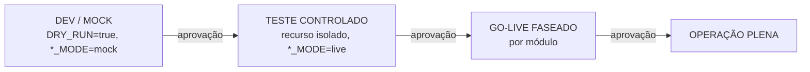

# Critérios de Sucesso & Guidelines — Frota AI · Transportes Molinett

> Documento 4 de 4 · como medir que a plataforma cumpre o contratado, o que é "pronto" por módulo, e os guardrails invioláveis derivados das regras e riscos **reais** deste projeto. Critérios de aceite alinhados ao **Escopo v3 §14** e aos módulos. `[A VALIDAR]` onde depende de definição da Molinett.

---

## 1. KPIs de negócio

| KPI | Baseline | Meta | Medição |
|---|---|---|---|
| Tempo de cotação | ~5 min | **< 30 s** | timestamp pedido→resposta (S01), p95 |
| Cotações sem "valor de cabeça" | minoria | **100% com custo real/placa** | % cotações com custo automático |
| Margem perdida por erro de cotação | 3–5% | **→ 0** | margem praticada × ideal por OS |
| Defasagem da análise de viagem | dias/semanas | **tempo real** | atraso dado rastreador→painel |
| Atualização do custo do diesel | manual | **a cada abastecimento** | nº cupons OCR / abastecimentos |
| Horas/semana em consolidação manual | ~8 h `[A VALIDAR]` | **−70%** | horas reportadas pré/pós |
| Decisões financeiras modeladas | 0 | simulador/comparador em uso | nº de simulações/mês |
| Payback do investimento | — | **3–6 meses** | margem recuperada + horas economizadas |
| Adoção do canal proativo | 0 | resumo diário entregue/lido por perfil | entregas/leituras WhatsApp |
| Recebíveis com data realista | datas de NF | **data real por cliente** | acerto previsto × realizado |

---

## 2. Definition of Done por módulo (checklists verificáveis)

### 2.1 Camada transversal
- [ ] RBAC com 7 perfis e permissões granulares (ler/escrever/aprovar/configurar), **editáveis pelo Administrador sem suporte técnico**.
- [ ] Trilha de auditoria ativa em **todos** os módulos (autor, o quê, quando, motivo); **versão anterior preservada** antes de cada edição.
- [ ] Offboarding revoga acesso (telas + WhatsApp) imediatamente; histórico preservado; exportação em massa bloqueada p/ perfis operacionais.
- [ ] Ação sensível **notifica o Gestor Principal** (WhatsApp + painel).

### 2.2 S01 — Cotação
- [ ] Cotação **< 30 s** em web **e** WhatsApp, com **5 margens** (0/5/10/15/20%) e **custo/km explícito**.
- [ ] **Bloqueio efetivo** de conversão em OS quando margem **< 0%**, com mensagem clara.
- [ ] Tabela mínima por companhia com média R$/km sobre o valor total.
- [ ] OS gerada automaticamente após confirmação, com **snapshot imutável** p/ atendimento, visível ao motorista no S04.
- [ ] Painel de metas atualizado a cada OS (reflete contas a pagar do S05 e custo/km do S03).
- [ ] **Conta global de saldo a recuperar** com sugestão de margem ajustada.
- [ ] Solicitação de alteração de OS roteada ao gestor com registro em auditoria.
- [ ] Notificação ao motorista, **na conclusão**, com o valor exato da comissão.

### 2.3 S02 — WhatsApp proativo
- [ ] Cloud API oficial conectada com **número dedicado**.
- [ ] **≥ 10 categorias de alerta** com add/desativar pelo painel sem suporte técnico.
- [ ] Resumo diário + semanal prospectivo + aviso 1 dia antes de vencimentos, por perfil.
- [ ] **≥ 8 comandos** de consulta/ação por chat, com **texto E áudio** (transcrição).
- [ ] Captura por palavra-chave em ≥ 1 grupo, criando registro nos módulos. `[A VALIDAR]` abordagem oficial (Doc 2 §1.7).
- [ ] Leitura de notas/orçamentos de oficina, identificando placa e abrindo OS de manutenção. `[A VALIDAR]`

### 2.4 S03 — Frota, Manutenção e Diesel
- [ ] Painel principal completo (vencimentos por placa c/ cobertura, por motorista c/ aviso ao motorista, centro de custo, consumo, próximas revisões).
- [ ] **KM via OCR de painel** como **fonte primária**.
- [ ] Revisões monitoradas **por item** (km E data), com recálculo isolado em troca fora de ciclo.
- [ ] Sugestão de postos cruzando preço/rendimento/horário/rota.
- [ ] Pneus por código com **troca/rodízio/virada** distintas + posição completa, por veículo com eixos próprios.
- [ ] Preditiva detectando concentração por setor (incl. "implemento") com reserva de caixa coordenada ao S05.
- [ ] Agendamento cruzando agenda do S04 com 3 prioridades.
- [ ] Custo por veículo em tempo real com componentes e à vista × futuro.

### 2.5 S04 — Viagens e Jornada
- [ ] Integração funcional com **≥ 1 rastreador** (posição/motor/paradas/velocidade). **(depende do G0)**
- [ ] **KM do hodômetro (OCR)** — rastreador **não** usado como fonte de km.
- [ ] OS chega automática do S01 ao painel do motorista (rota c/ link, comissão visível, cliente clicável).
- [ ] Comissão registrada no momento configurado; pagamento **só após conclusão**.
- [ ] Painéis por motorista e por placa (incl. comparativo c/ mês de menor desempenho).
- [ ] Análise pós-serviço por OS (HP/HT, positivo/negativo) + contador de OS canceladas/perdidas.
- [ ] Hora extra por classe p/ folha e tributos.
- [ ] **Lei do Motorista** verificada na atribuição (sugestão alternativa em conflito) — regras pós-ADI 5322.
- [ ] Aviso de tacógrafo (disco/aferição).

### 2.6 S05 — Inteligência Financeira
- [ ] Cadastro de clientes com **regra de prazo configurável** + modelos pré-definidos.
- [ ] **Fluxo de caixa projetado dia a dia**; reagenda atraso, antecipa adiantamento.
- [ ] **Migração integral** da planilha mestra (plano de contas, CC, código, DRE, imobilizado, tributos, RH).
- [ ] Cálculo **diário** das duas metas (faturamento mín. + km máx.).
- [ ] Sugestão de forma de pagamento conforme caixa projetado.
- [ ] **Conta bancária obrigatória** em cada lançamento.
- [ ] Geração automática de parcela + reformulação de juros em atraso > 30 dias.
- [ ] Simulador de financiamento + comparador de cenários (TIR/VPL/payback) com **taxas reais** (BCB SGS/Tesouro no MVP).
- [ ] Tributos **parametrizáveis por competência** (preparado p/ CBS/IBS).

### 2.7 Entrega geral (Escopo v3 §14)
- [ ] 5 módulos funcionais, acessíveis e **integrados**; fluxos da Matriz de Interoperabilidade validados em casos reais simulados.
- [ ] Dados históricos importados e consultáveis.
- [ ] Equipe treinada por perfil (≥ 1 sessão) + material escrito.
- [ ] Painéis consolidados funcionando com dados reais.
- [ ] **Sem defeitos P1/P2 abertos** (P3/P4 tratáveis na recorrência).

---

## 3. Critérios técnicos transversais

| Critério | Exigência |
|---|---|
| **Idempotência** | Webhooks (WhatsApp, rastreador) e jobs com chave de deduplicação; reprocesso não duplica OS, lançamento ou alerta |
| **Resiliência / retry** | Backoff exponencial + DLQ na fila; chamadas externas com timeout e circuit breaker; webhook responde 200 rápido e processa async |
| **Observabilidade** | Logs estruturados + correlação; métricas de fila, latência de IA e qualidade do número WhatsApp; alarmes de uptime do webhook |
| **Segredos** | Fora do client e do repositório; em secrets manager; rotação quando aplicável |
| **Conformidade legal** | Jornada (Lei 13.103 pós-ADI 5322), tacógrafo, toxicológico/CNH como regras vivas; tributos parametrizáveis (CBS/IBS) |
| **Privacidade / LGPD** | Base legal por tipo de dado (CPF=obrigação legal; GPS=legítimo interesse c/ LIA; voz=sensível, art. 11); direitos do titular (15 dias); incidente em 3 dias úteis; dados em região BR `[A VALIDAR]` |
| **Sem regressão nos sistemas integrados** | A Frota AI **lê** dos sistemas de origem (rastreador, banco, SEFAZ) sem alterá-los; nenhuma escrita não-autorizada; planilhas só viram "referência" **após** aceite |
| **Reprodutibilidade de IA** | Registrar modelo/versão e prompt usados em decisões (OCR, NLU); confirmação humana em baixa confiança |

---

## 4. Saúde por integração ("verde quando…")

| Integração | 🟢 Verde quando… | 🔴 Vermelho quando… |
|---|---|---|
| WhatsApp | webhook 200 < 2 s, número GREEN, templates aprovados, opt-in registrado | número YELLOW/RED, template rejeitado, falha de assinatura |
| Rastreador | dados chegando no intervalo esperado, parsing 100% no schema canônico | sem dados > X min, campos faltando, auth expirada |
| OCR hodômetro/cupom | confiança ≥ limiar, km monotônico crescente, cupom casado com abastecimento | km decrescente/salto, abastecimento sem cupom (pendência), confiança baixa |
| IA (NLU/voz) | intenção reconhecida, structured output válido | alucinação/baixa confiança → cai p/ confirmação humana |
| SEFAZ | consulta/distribuição respondendo, certificado válido | certificado vencido, ambiente fora do ar |
| Mercado (BCB/Tesouro) | série atualizada do dia | série defasada > 1 dia útil |
| Financeiro interno | toda receita/despesa com **conta bancária** e classificação | lançamento órfão (sem conta/CC) |

---

## 5. Gates de promoção (cada um com aprovação humana)

| Gate | Entrada → saída | Aprovação humana |
|---|---|---|
| **G-A Dev/Mock** | payloads validados contra schema, sem efeito externo | Tech lead Grupo Diga |
| **G-B Teste controlado** | live só em **número/aparelho/empresa de teste**; nada de dados reais de cliente | Grupo Diga + ponto focal Molinett |
| **G-C Go-live faseado** | módulo por módulo em produção (sugestão: S01+S02 → S03+S04 → S05) | **Gestor Principal Molinett** |
| **G-D Operação plena** | todos os módulos integrados, KPIs medidos, P1/P2 zerados | **Gestor Principal Molinett (explícito)** |

> Nenhuma promoção sem aprovação. Cada gate registra quem aprovou, quando e com qual evidência.

---

## 6. Guardrails invioláveis (derivados das regras e riscos reais)

1. **Margem negativa nunca vira OS automaticamente.** Margem < 0% exige renegociação, cancelamento ou aprovação manual do gestor (registrada, inclusive por voz).
2. **OS gerada é imutável** para o atendimento. Alteração só por fluxo de aprovação do gestor; versão original preservada.
3. **KM tem fonte primária única: hodômetro via OCR.** O rastreador **não** alimenta km — não usar como fonte para revisão, custo/km ou cobrança.
4. **Meta nunca abaixo do piso calculado.** O gestor pode aumentar, nunca reduzir abaixo do mínimo do S05.
5. **Conta bancária obrigatória em todo lançamento financeiro** — sem lançamento órfão.
6. **Nada de WhatsApp não-oficial.** Apenas Cloud API/BSP oficial; respeitar opt-in e janela de 24h (fora dela, só template aprovado).
7. **Não escrever nos sistemas de origem sem autorização explícita.** A plataforma é camada por cima; rastreador, banco e SEFAZ permanecem donos do dado.
8. **Planilha mestra só vira "referência" após aceite** da migração — nunca descontinuar a fonte antes da validação item a item.
9. **Sem efeito externo em teste.** `DRY_RUN`/`*_MODE=mock` por padrão; live só em recurso isolado; produção só após gates.
10. **Segredos jamais no front/repo.** Certificado e-CNPJ, tokens e chaves só no servidor/secrets manager.
11. **LGPD por padrão.** GPS e voz com base legal documentada; minimizar retenção; trilha de auditoria; atender direitos do titular; notificar incidentes no prazo.
12. **Ação em destinatário/registro certo.** Roteamento por perfil, identificação inequívoca de veículo/motorista; em ambiguidade (placa/cliente), **aguardar confirmação** antes de agir.
13. **Bloqueio por conformidade de jornada/documento.** Não alocar OS que estoure a Lei do Motorista; sinalizar CNH/toxicológico/tacógrafo vencidos.
14. **Confiança de IA com humano no circuito.** OCR/NLU abaixo do limiar → confirmação humana, nunca decisão silenciosa.

---

*Grupo Diga · Frota AI — Critérios de Sucesso & Guidelines · Transportes Molinett · v1.0 · 2026-06-15*
