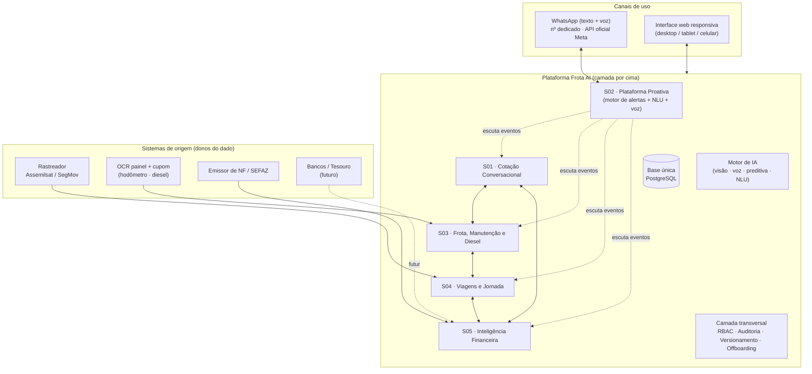
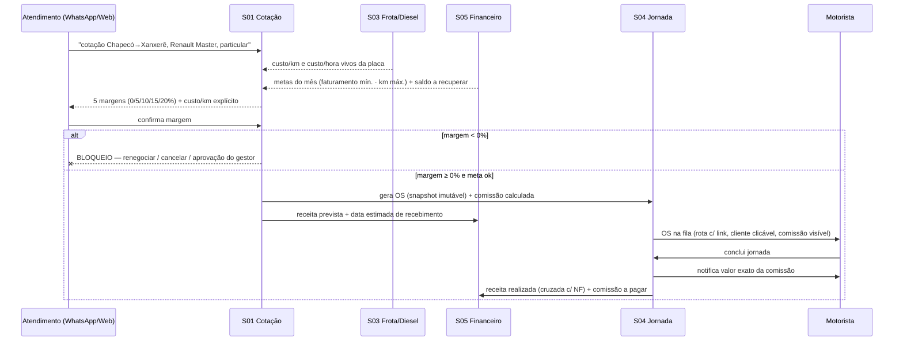
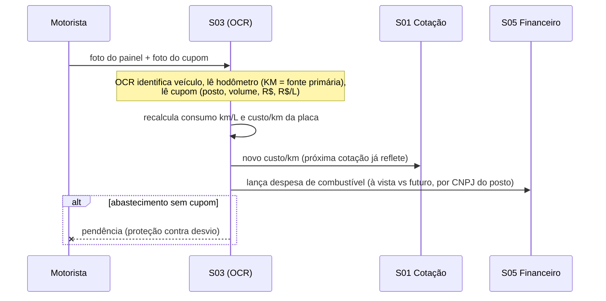
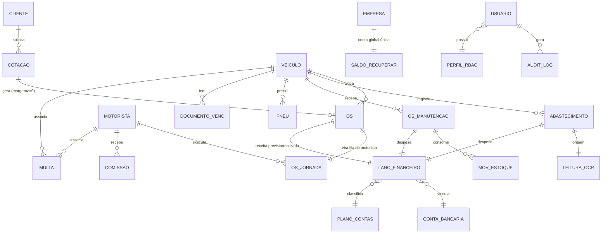

# Escopo Funcional — Frota AI · Transportes Molinett

> Documento 1 de 4 · base técnico-comercial para construção do projeto na sessão de implementação.
> Derivado do **Escopo Técnico v3** (anexo contratual, 42 págs.), da **apresentação comercial** e de **pesquisa dirigida** das integrações e normas reais (junho/2026). Tudo o que não está no material nem foi confirmável por fonte está marcado **`[A VALIDAR]`**.

---

## 0. Identificação

| Campo | Valor |
|---|---|
| Cliente | **Transportes Molinett** (operação familiar de reboques, guinchos, plataformas e Munck — Quilombo/SC) |
| Fornecedor | **Grupo Diga / Frota AI** (`digaai.tech`) |
| Produto | **Frota AI** — plataforma única com 5 módulos de IA ("sistema operacional da Molinett") |
| Plano contratado | **Plano 02 — "Compra Óbvia"** (Sistemas 01 a 05, plataforma completa) |
| Investimento | **R$ 20.000,00** em 5× de R$ 4.000,00 |
| Recorrência mensal | **R$ 1.100,00** `[A VALIDAR]` — a pág. 1 do Escopo v3 diz R$ 1.000,00; pág. 37 e a apresentação dizem R$ 1.100,00. Confirmar valor oficial |
| Prazo | **45 dias corridos** a partir da assinatura (entrega única) + homologação (dias 45–60) |
| Frota | 5 veículos ativos + 1 cavalo aguardando implemento — códigos internos **MLC, AAW, MHG, IFF, IQU, RLI** |

---

## 1. O que foi contratado

A entrega **não é** uma coleção de softwares isolados nem consultoria/treinamento: é o **desenvolvimento sob medida de uma plataforma única**, com base de dados única, camada de inteligência única e canal preferencial único (WhatsApp). Cada dado registrado em qualquer módulo passa imediatamente a alimentar os demais.

### 1.1 Princípio arquitetural central

> **Camada de inteligência por cima dos dados que a empresa já tem.** A Molinett não sofre de falta de dados — sofre de falta de *inteligência sobre os dados* e de *proatividade* ("software não vem até mim; eu é que preciso ir até ele"). A plataforma inverte isso: a informação chega via WhatsApp, e nove planilhas dispersas viram uma única fonte da verdade.

Quando um sistema do cliente é **registro de origem** (rastreador, banco, emissor de NF), a Frota AI atua como **camada por cima** — consome e cruza, sem substituir o sistema dono do dado. As **planilhas**, ao contrário, são **explicitamente substituídas** (decisão de escopo do cliente).

### 1.2 Incluso × Fora de escopo

| ✅ Incluso no Plano 02 | 🚫 Fora de escopo (caminho aberto / projeto à parte) |
|---|---|
| Sistema 01 — Calculadora de Cotação Conversacional | Integração viva com **APIs bancárias / Open Finance** (confirmação automática de pagamento) — *futura/bloqueante* |
| Sistema 02 — Plataforma Proativa via WhatsApp | Integração com **sistema do Adv. Tauã** (multas) — *futura opcional* |
| Sistema 03 — Gestão de Frota, Manutenção e Diesel | Integração com **sistema da Keily** (RH/disciplina) — *futura opcional* |
| Sistema 04 — Análise de Viagens e Jornada | **Emissão** de Nota Fiscal Nacional (quando a Reforma liberar p/ transporte) — *futura* |
| Sistema 05 — Inteligência Financeira de Decisão | **App nativo** Android/iOS dedicado — *a definir* (escopo prevê web responsiva + WhatsApp) |
| Camada transversal: RBAC, auditoria, offboarding, notificações | Funcionalidades novas além deste escopo — *orçamento à parte* |
| WhatsApp Business API oficial + nº dedicado | |
| Integração com **ao menos 1 rastreador** (Assemilsat **ou** SegMov) | |
| OCR de painel (hodômetro) + cupom de abastecimento | |
| Motor de IA: preditiva de manutenção, orçamento de peças, sugestão de postos, leitura de notas de oficina, NLU e voz | |
| Migração integral da estrutura contábil gerencial (planilha mestra → Sistema 05) | |
| Importação de dados históricos das planilhas | |
| Treinamento por perfil (≥1 sessão) + material escrito | |

**Modalidade:** entrega única ao final dos 45 dias, com homologação. Suporte/infra/integrações cobertos pela recorrência mensal.

---

## 2. Problemas e objetivos — mapeamento dor → funcionalidade

| # | Dor mapeada (evidência do cliente) | Severidade | Resolvida por |
|---|---|---|---|
| 01 | **Cotação manual e lenta** — "no atendimento que é muito rápido você tem que fechar negócio", opera-se com *valor de cabeça*, sacrificando margem | 🔴 Crítico | S01 (cotação < 30s, 5 margens, custo real/placa) |
| 02 | **Jornada/viagens analisadas no retrovisor** — dados do rastreador digitados à mão; "sempre análise do passado, nunca em tempo real" | 🔴 Crítico | S04 (ingestão automática) + S03 (hodômetro/OCR) |
| 03 | **Custo do diesel por placa monitorado à mão** — volatilidade não reflete no custo/km da cotação → risco de vender abaixo do custo | 🟠 Importante | S03 (OCR de cupom + custo/km vivo → S01) |
| 04 | **Decisão de financiamento sem ferramenta** — "quebrando a cabeça para saber qual parcela posso assumir sem risco" | 🔴 Crítico | S05 (simulador de financiamento + comparador TIR/VPL) |
| 05 | **Previsão de caixa sem visibilidade integrada** — contas existem em planilhas separadas, sem projeção | 🟠 Importante | S05 (fluxo de caixa projetado por prazo real de cliente) |
| 06 | **Software passivo** — "você precisa ir até ele buscar informação, ela não vem até você" | 🟠 Importante | S02 (proatividade via WhatsApp: resumos, alertas, comandos) |

**Objetivo macro:** transformar 100% de gestão retroativa em planilha numa operação **proativa e em tempo real**, calibrada para o momento de **tripla transição** (renovação de frota, expansão geográfica MG/SP/BA, vaga aberta).

---

## 3. Fatores externos críticos (pesquisados e citados)

Restrições reais que moldam o escopo — confirmadas em fontes oficiais (jun/2026). Detalhe e citações em [Documento 2 — Integrações](integracoes-molinett.md) e nos anexos de pesquisa (`normas_jornada_frota_2026.md`, `pesquisa_juridico_fiscal_junho2026.md`).

1. **Rastreadores sem API pública.** Nem **Assemilsat** nem **SegMov** publicam API/documentação. A Assemilsat roda sobre a plataforma **Log Soluções** (Chapecó/SC), que **possui webservice** de posição+eventos para ERPs — mas só por contrato/credenciais. A SegMov é micro-operadora (Francisco Beltrão/PR), sem site/app/API. → **Decisão técnica bloqueante** (seção 9 e Doc 2).

2. **Lei do Motorista (Lei 13.103/2015) + ADI 5322/STF (30/06/2023).** O STF derrubou parte da lei. Regras vivas que viram bloqueio/alerta de software: direção contínua **máx. 5h30** (parada de 30 min a cada 6h — CTB art. 67-C); **interjornada de 11h contínuas, não fracionável**; **descanso semanal de 35h**; **tempo de espera conta como jornada**; revezamento só descansa com veículo parado. Fonte: [Planalto/CLT](https://www.planalto.gov.br/ccivil_03/decreto-lei/del5452.htm), [STF ADI 5322](https://portal.stf.jus.br/noticias/verNoticiaDetalhe.asp?idConteudo=510120).

3. **Tacógrafo e habilitação.** Aferição INMETRO **a cada 2 anos**; **exame toxicológico a cada 30 meses** (C/D/E < 70) independente da CNH, com multa gravíssima após 30 dias do vencimento; CNH válida 10/5/3 anos por faixa etária. → alertas e bloqueio de alocação. Fonte: [Inmetro](https://www.gov.br/inmetro/pt-br/composicao/surrs/servicos/cronotacografos), [CTB](https://www.planalto.gov.br/ccivil_03/leis/l9503compilado.htm).

4. **Reforma Tributária (CBS/IBS).** **2026 é ano-teste**: CBS 0,9% + IBS 0,1%, compensáveis, **recolhimento dispensado** se cumpridas as obrigações acessórias (art. 348, LC 214/2025); desde **01/01/2026 todo documento fiscal eletrônico destaca IBS/CBS/IS**. → a estrutura tributária do S01/S05 **precisa ser parametrizável por competência**. Fonte: [LC 214/2025](https://www.planalto.gov.br/ccivil_03/leis/lcp/lcp214.htm).

5. **Documento fiscal do serviço.** Reboque/guincho pode ser tratado como **transporte de carga (CT-e modelo 57 / ICMS)** *ou* como **serviço (ISS / NFS-e)** — o Escopo v3 lista **ISS 2%**, mas há entendimento de SEFAZ de que remoção de veículo é CT-e. **`[A VALIDAR]`** com a contabilidade da Molinett: define o documento a emitir e como cruzar receita realizada (XML / `NFeDistribuicaoDFe` / leitura de QR Code). Fonte: pesquisa fiscal anexa.

6. **LGPD (Lei 13.709/2018).** O sistema trata CPF, CNH, **localização GPS em tempo real de motoristas** (legítimo interesse com LIA documentado) e potencialmente **biometria de voz** (dado sensível, art. 5º II — exige base do art. 11). Exigências que viram requisito: trilha de auditoria (= registro de operações, art. 37), atendimento a direitos do titular (15 dias), notificação de incidente em **3 dias úteis** (Res. ANPD 15/2024). Fonte: [LGPD](https://www.planalto.gov.br/ccivil_03/_ato2015-2018/2018/lei/l13709.htm).

7. **WhatsApp = canal regulado pela Meta.** Mensagens proativas exigem **opt-in**; fora da janela de 24h só **templates aprovados**; cobrança por template entregue desde 01/07/2025. Usar **API oficial** (Cloud API/BSP) — soluções não-oficiais (Z-API/Evolution) violam os Termos e arriscam banimento do número. Fonte: [Meta for Developers](https://developers.facebook.com/docs/whatsapp/cloud-api/).

---

## 4. Arquitetura geral e fluxos canônicos

### 4.1 Visão de blocos



### 4.2 Fluxo canônico 1 — Cotação → OS → Jornada → Caixa



### 4.3 Fluxo canônico 2 — Abastecimento → custo vivo (OCR como fonte primária de KM)



### 4.4 Principais decisões técnicas (do escopo)

- **KM tem fonte primária única: hodômetro via OCR de painel.** O rastreador **não** é fonte de KM (precisão insuficiente para revisões, custo/km e cobrança). Rastreador = posição, motor, paradas, velocidade, hora-extra.
- **OS de cotação é imutável após geração** (snapshot). Alteração → fila de aprovação do gestor; cancelamento → permitido, mas notifica o gestor.
- **Conta global única de "saldo a recuperar"** (não por cliente/rota/atendente).
- **Metas dinâmicas**, recalculadas diariamente conforme novas despesas/receitas.
- **WhatsApp oficial** + web responsiva; tudo "rápido" cabe no WhatsApp, o computador é para visão consolidada.

---

## 5. Funcionalidades detalhadas (por módulo)

> Para cada funcionalidade: **o que faz · regras · critérios de sucesso · exceções/edge cases**. Estruturas de dados núcleo em §8; payloads de integração em [Doc 2](integracoes-molinett.md).

### 5.0 Camada transversal (vale para todos os módulos)

- **RBAC por níveis.** Perfis: *Atendimento, Motorista, Operacional, Gestor de Manutenção, Financeiro, Gestor Principal, Administrador*. Matriz de permissões (ler/escrever/aprovar/configurar) editável pelo Administrador **sem suporte técnico**.
  - *Regras:* toda alteração de permissão logada (autor, data, motivo). Ações sensíveis notificam o Gestor Principal (WhatsApp + painel).
  - *Critério:* permissões granulares ativas e auditáveis; notificação disparando.
  - *Exceções:* só Gestor Principal e Administrador exportam dados completos.
- **Trilha de auditoria e versionamento.** Toda OS, cotação, lançamento, OS de manutenção e movimento de estoque preserva a versão anterior antes de editar. *Sem edição silenciosa.*
- **Offboarding.** Saída de funcionário → Administrador revoga acesso imediato em todas as telas e no canal WhatsApp; histórico preservado; exportação em massa bloqueada para perfis operacionais.
- **Canais.** Web responsiva (análise/config) + WhatsApp (operação proativa, texto e voz).

---

### 5.1 Sistema 01 — Calculadora de Cotação Conversacional

| Funcionalidade | O que faz / regras | Critério de sucesso | Exceções / edge cases |
|---|---|---|---|
| Cotação por WhatsApp ou web | Interpreta linguagem natural (rota, veículo, tipo) → calcula custo → devolve 5 margens + custo/km explícito p/ argumentação | Cotação em **< 30 s** nos dois canais, 5 margens simultâneas | Frase ambígua → pede confirmação; rota desconhecida → solicita origem/destino |
| 5 cenários de margem | 0%, 5%, 10%, 15%, 20% sobre o **custo real por placa** | Valores corretos lado a lado | — |
| Custo real por placa | Vem do S03 (diesel, manutenção, pneus, depreciação, documentação rateada), atualizado diariamente | Custo reflete o dia | Mês com custo atípico (manutenção pesada) → opção de usar **média histórica ajustada por inflação** como *fallback*, com saldo da diferença na conta global |
| Tributos parametrizados | PIS 0,65%, COFINS 3%, CSLL 1,08%, IRPJ 1,2%, ISS 2%, comissões/adm/terceiros variáveis — editáveis com histórico | Tela de parametrização por competência | **Reforma:** estrutura preparada para CBS/IBS por competência `[A VALIDAR]` enquadramento |
| Tabela mínima por companhia | Piso de R$/km por cliente/seguradora (valor de saída, km de saída, km excedente > 40 km, HT, HP) | "Não cobrar abaixo deste valor para esta companhia" | — |
| **Bloqueio de margem negativa** | Margem **< 0%** não vira OS: renegociar, cancelar ou **aprovação manual do gestor** (registrada, inclusive por voz) | Bloqueio efetivo com mensagem clara | Aprovação excepcional fica registrada |
| Subsistema de metas | Valida se a cotação respeita **faturamento mínimo** e **km máximo** do mês (do S05). Meta ferida → pendência de aprovação (não bloqueio total) | Painel "faltam R$ X / restam Y km / Z OSs em aberto" atualizado a cada OS | Gestor pode **aumentar** a meta, nunca reduzir abaixo do piso |
| Espaço de negociação / saldo a recuperar | Registra déficit (R$ + justificativa) na **conta global** da empresa; cotações futuras sugerem margem ajustada para cima | Saldo visível e decrescente conforme compensações | Saldo único — qualquer atendente compensa em qualquer OS |
| Geração de OS | Confirmada → OS com nº sequencial e **snapshot imutável** (rota, cliente, valor, custo, margem, motorista, veículo, timestamp) → vai ao S04 | OS gerada automática e imutável p/ atendimento | Alteração → fila do gestor; cancelamento → notifica gestor |
| Salvamento de toda cotação | Mesmo as não fechadas (taxa de fechamento, margem média, motivo de recusa) | Histórico consultável | — |

**Planilha absorvida:** `CALCULO x SERVIÇO.xls` (abas PV_SV PRESUM, PV x Lucro, Cotação por mês).

#### Estrutura da Ordem de Serviço (snapshot) — núcleo
```json
{
  "os_id": "OS-2026-001247",
  "tipo": "cotacao",
  "cliente": { "nome": "Localiza", "prazo_recebimento_dias": 14, "telefone": "+55..." },
  "rota": { "origem": "Chapecó/SC", "destino": "Xanxerê/SC", "link_maps": "https://...", "km_previsto": 52 },
  "veiculo": "IFF",
  "motorista": "...",
  "custo_previsto": 249.60, "custo_km": 4.80,
  "margem_aplicada_pct": 15, "valor": 364.00,
  "comissao": { "motorista_pct": 8, "valor": 29.12 },
  "metas_no_momento": { "faturamento_min_restante": 38250.00, "km_max_restante": 1840 },
  "saldo_recuperar_no_momento": 820.00,
  "status": "gerada", "imutavel": true, "timestamp": "2026-06-15T14:03:00-03:00",
  "aprovacao_gestor": null
}
```

---

### 5.2 Sistema 02 — Plataforma Proativa via WhatsApp

| Funcionalidade | O que faz / regras | Critério de sucesso | Exceções / edge cases |
|---|---|---|---|
| WhatsApp Business API oficial | Nº dedicado da Molinett; mensagens vinculadas a usuário + módulo, com auditoria | API conectada e funcional | Offboarding revoga canal |
| Resumos diários/semanais | Horários por perfil (gestora 07h, manutenção 07h30, atendimento 08h); resumo prospectivo da semana; aviso 1 dia antes dos vencimentos com caixa projetado | Entregues aos perfis configurados | Fora da janela 24h → **template aprovado** |
| Alertas críticos por evento | Escuta os módulos e dispara (diesel acima da média, parcela no limite, multa nova, OS cancelada, estoque baixo, documento a vencer…) | **≥ 10 categorias** ativas, com add/desativar pelo painel | Roteamento **por perfil**, não por pessoa |
| Comandos por chat (texto e voz) | "qual meu saldo?", "agendar manutenção do MLC", "liberar OS 1247" — interpreta (transcreve voz), executa se o perfil permitir, responde | **≥ 8 comandos** funcionais com texto **e** áudio | Comando sem permissão → recusa registrada |
| Aprovações via WhatsApp | Gestor aprova/rejeita (alteração de OS, cotação abaixo da meta, manutenção pesada) do celular | Decisão com timestamp + justificativa | — |
| Captação via grupo (palavra-chave) | Monitora grupos (ex.: manutenção); palavras `precisa, precisamos, solicito, preciso comprar, preciso arrumar, peguei` → cria registro (OS manutenção, baixa estoque) | Captura em ≥ 1 grupo com criação automática | Veículo ambíguo → aguarda confirmação |
| Leitura de notas de oficina | Lê notas/orçamentos enviados (incl. etiqueta da Karina), identifica placa, abre OS de manutenção no S03 | Leitura + abertura de OS funcional | Placa não identificada → aguarda confirmação do gestor |

> **Observação técnica:** "monitorar grupos" e ler "etiquetas" do WhatsApp têm **limitações na API oficial da Meta** (a Cloud API entrega mensagens do número de negócio, não espelha grupos arbitrários como um cliente web). Ver [Doc 2 §1](integracoes-molinett.md) — é um ponto de **arquitetura a validar** (provável necessidade de um número/fluxo dedicado de captação, ou abordagem alternativa). `[A VALIDAR]`

---

### 5.3 Sistema 03 — Gestão de Frota, Manutenção e Diesel

Módulo mais robusto. Reúne combustível (planilha da Maiara), manutenção (planilhas do Patrick) e pneus/alinhamento/documentação. Princípio: *o caminhão só roda se a manutenção estiver em dia*.

- **Painel principal de frota:** vencimentos por placa (IPVA, licenciamento, seguros Bradesco/Aprotoca/Allianz com cobertura, franquia e responsável pelo acionamento); vencimentos por motorista (CNH, toxicológico, tacógrafo, MOPP, NR-20); centro de custo por caminhão; média de consumo; próximas revisões.
- **Revisões granulares por item** (vencimento por km **e** data): óleo motor (180 dias/km), filtros (óleo, ar, Racor, cabine, pneumático, hidráulico), compressor desumidificador, transmissão, diferencial + parametrizáveis. Alerta padrão **1.000 km antes** (configurável). Troca fora de ciclo recalcula **só aquele item**.
- **KM por OCR de painel (fonte primária):** a cada abastecimento, foto do painel + cupom → identifica veículo pelo layout do painel + placa, lê hodômetro, lê cupom (posto/volume/valor/R$ por L), calcula consumo km/L, sinaliza abastecimento sem cupom. Alternativa: cartão combustível (incl. Inter Empresas).
- **Sugestão inteligente de postos:** com base em preço/rendimento/horário e rota atual, sugere postos no caminho (WhatsApp).
- **Detecção de anomalia de consumo:** queda da média semanal vs histórica do veículo → alerta com causas prováveis; cruza preço×consumo por posto (diesel adulterado).
- **Controle de pneus individualizado:** cada pneu com código (A,B,C…), marca/modelo/medida, compra, NF, foto, posição (tração/dianteira/traseira/direita/esquerda/fora/dentro); operações distintas **troca · rodízio · virada**; recapagens (1ª, 2ª) no histórico; eixos variáveis por veículo.
- **Alinhamento/balanceamento/geometria:** histórico por veículo com motivo; sugestão automática após estouro/sinistro.
- **Auxiliar de orçamento de peças (IA):** histórico de preço por peça/fornecedor (12–24 meses), **busca online** de preço de mercado por código, lê conversa com fornecedor e sugere argumentos, aprende melhor fornecedor por categoria.
- **Análise preditiva:** concentração de falhas por subsistema (limiar configurável, padrão **5 OS/90 dias**) → sugere revisão completa; vida útil por componente; **reserva de caixa** para manutenção pesada (sinaliza ao S05 → ajusta meta do S01); diagnóstico assistido por histórico de sintomas.
- **OS de manutenção:** status *Solicitado / Em Aberto / Aguardando Peça / Agendado / Em Execução / Concluído*; tipo, prioridade (Alta/Média/Baixa), oficina, valores estimado/real, prazo.
- **Estoque:** mínimo por item; baixa via WhatsApp ("peguei" + foto); alerta de compra ao bater o mínimo.
- **Agendamento na oficina (cruza S04):** Prioridade **Alta** bloqueia o veículo na agenda; **Média** permite serviço curto; **Baixa** só registra. Conclusão → notifica atendimento ("liberado às HH:MM").
- **Orçamento mensal de manutenção (cruza S05):** comprometido × livre; sugere reagendar quando o caixa não comporta.
- **Custo total por veículo em tempo real:** combustível + manutenção + pneus (depreciação proporcional) + documentação rateada + depreciação contábil → **custo/km vivo** para o S01.

**Critérios de sucesso (resumo):** painel completo; KM por OCR; revisões por item com recálculo isolado; sugestão de postos; pneus com 3 operações e posição completa; preditiva por setor; captura por grupo; agendamento com 3 prioridades; custo/veículo em tempo real.

**Edge cases:** veículo novo sem histórico (usar similar mais próximo — critério `[A VALIDAR]`); cavalo aguardando implemento (cadastro flexível de eixos/posições); abastecimento por cartão sem foto.

**Planilhas absorvidas:** `REGISTRO COMBUSTÍVEL 2026 MAIARA.xlsx`, `Seguro caminhões.xlsx`, `Multas.xlsx`, planilhas em construção do Patrick.

---

### 5.4 Sistema 04 — Análise Inteligente de Viagens e Jornada

- **Visão em tempo real:** o que cada caminhão está fazendo, onde está, rota em execução, estado (rodando / parado com motor / em descanso) — via rastreador.
- **Integração com rastreador:** posição, motor on/off, paradas, velocidade, tempo em viagem × motor parado. **KM não vem do rastreador** (vem do OCR/S03).
- **Recebe OS do S01** na fila do motorista: rota com link (origem/destino fixados pelo atendimento, **não sobrescrevíveis** pelo GPS do motorista), valor **visível só ao atendimento** (motorista vê só sua comissão e só ao concluir), cliente com **link clicável de telefone**, previsão de tempo/km por rotas similares.
- **Comissão automática:** percentual por motorista e tipo de serviço (replica "Comissão gerado por funcionário"); % médio mensal retroalimenta o S01.
- **Análise pós-serviço:** receita real × prevista, tempo real × previsto, **custo de destombamento** (HP com motor ligado × desligado), serviço positivo/negativo; consolida **OS canceladas/perdidas** (base p/ decisão de capacidade).
- **Painel por motorista** e **painel por placa** (incl. comparativo com mês de menor desempenho; ranking de rentabilidade).
- **Lei do Motorista incorporada:** sabe limite de direção/descanso; OS que estoura a jornada → sinaliza na criação e sugere outro motorista (regras vivas pós-ADI 5322 — §3.2).
- **Hora extra para folha/tributos:** relatórios por classe (diurna, noturna, feriado, domingo) por motorista.
- **Aviso de troca de tacógrafo (disco/aferição).**

**Planilhas absorvidas:** `Controle de jornada 2026.xlsx`, `Comissão gerado por funcionário 2026.xlsx`.

**Edge cases (Lista de Dúvidas):** motorista freelancer; 2 motoristas na mesma OS (revezamento); alterar OS em movimento / pular trecho da rota; como o sistema sabe qual motorista e início/fim de jornada (§9).

---

### 5.5 Sistema 05 — Inteligência Financeira de Decisão

> **Decisão de escopo:** o S05 **substitui integralmente** a planilha mestra `ORIGINAL PARA TRABALHAR.xlsm` — plano de contas, centros de custo, código de conta, DRE por veículo, imobilizado, depreciação, tributos, RH por CC, regime de competência, abas REC/ADM/VD/FIN/TRIB/VAR/PROD. Após a entrega, a planilha vira só referência histórica.

- **Fluxo de caixa projetado realista:** receita pela **data real prevista de recebimento** (varia por cliente). Regras pré-carregadas da aba DATAS (Movida/SAT 30d, GENTE 20/30/10, Localiza 14d, SOON/DAF dia 5 e 20, MAWDY 30d, e demais). Recebimento atrasado → reagenda p/ próximo dia útil com alerta diário; recebimento adiantado → antecipa no fluxo e libera margem; cliente que atrasa cronicamente → ajusta previsão futura para cima.
- **Plano de contas / CC / DRE migrados** (hierárquico: CPV, Estoque, Administrativo, Comercial, Desp. Financeiras, Tributário, Desp. Variáveis, Produção; CC por veículo 9–22; DRE por MLC/AAW/MHG/IFF/IQU/RLI; imobilizado + depreciação; RH por CC vinculado ao S04).
- **Contas a pagar e receber:** tipologia R/D/E/M/DP; por lançamento (vencimento, NF, nome, forma de pagamento, crédito/débito, status, **conta bancária obrigatória**); despesas fixas com periodicidade; empréstimos com parcelas (Joana 11x, Marcos 23x) com **geração automática** de parcela; atraso > 30 dias gera nova parcela e reformula juros pelo contrato.
- **Metas dinâmicas:** recalcula diariamente faturamento mínimo (contas a pagar + margem de segurança, padrão 10%) e km máximo (receita necessária ÷ custo/km).
- **Conta global de saldo a recuperar** (monitorada e exposta no painel).
- **Sugestão de forma de pagamento** para nova despesa (à vista c/ desconto, parcelado, cartão em data X, antecipar dívida) conforme caixa projetado.
- **Simulador de financiamento:** "posso assumir parcela de R$ X?" — projeta o fluxo com a parcela, mostra meses em risco, calcula aumento de meta.
- **Comparador de cenários (TIR/VPL/payback):** aplicar × antecipar × reinvestir, com **taxas reais** de ofertas de investimento (CDB/LCI/LCA/fundos/Tesouro) — integração bancária é **futura/bloqueante**; no MVP usar **CDI/Selic via API do BCB (SGS)** e **CSV do Tesouro Transparente** (ver Doc 2 §6).
- **Previsão de impostos:** replica `Previsão de Impostos 2026.xlsx` com calendário fiscal e cálculo por NF; preparado para CBS/IBS por competência.

**Planilhas absorvidas:** `TM - CONTAS A PAGAR E RECEBER.xlsx`, `Previsão de Impostos 2026.xlsx`, `ORIGINAL PARA TRABALHAR.xlsm` (substituída integralmente), cálculo de empréstimos pessoais.

**Edge cases:** cruzamento receita realizada × NF emitida (automático via emissor / import XML / `NFeDistribuicaoDFe` — §9); regime caixa × competência (hoje **caixa** — confirmar).

---

## 6. Dados e regras de negócio fornecidos (versionar como parâmetros)

> Tudo abaixo deve viver como **parâmetro versionado** (não hard-coded) — ver [Doc 4](criterios-de-sucesso-molinett.md).

### 6.1 Frota (códigos internos)
`MLC`, `AAW` (Mercedes), `MHG` (VW Constellation), `IFF` (Volvo), `IQU`, `RLI`. Tipos: caminhão lança, plataforma, Munck, cavalo (implemento `[A VALIDAR]` — provável plataforma rebaixada). Cada veículo define **eixos e posições de pneu próprios**.

### 6.2 Tributos (Lucro Presumido / serviço) — parametrizável por competência
| Tributo | Alíquota base | Obs. |
|---|---|---|
| PIS | 0,65% | Substituído por **CBS** na transição |
| COFINS | 3% | Substituído por **CBS** |
| CSLL | 1,08% | |
| IRPJ | 1,2% | |
| ISS | 2% | `[A VALIDAR]` se reboque é ISS (serviço) ou ICMS/CT-e (transporte) — §3.5 |
| Comissões / Adm / Terceiros | variável | por motorista/mês/serviço |

### 6.3 Clientes/seguradoras e prazos de recebimento (aba DATAS)
Movida/SAT **30d**; GENTE **dia 20/30/10**; Localiza **14d**; SOON/DAF **dia 5 e 20** do mês seguinte; MAWDY **30d**; + ANTRAC, PORTO, YELUM, TOKIO MARINE, EUROP ASSISTANCE, USS, FACIL ASSIST, AWP, TAG, ABC, JARDEL STEFANSKI, PARRON, TRANSPORTES JOANA, COPART, M&P FILHOS e outros. *(Importar do arquivo; regra de prazo configurável por cliente.)*

### 6.4 Parâmetros operacionais (defaults propostos — confirmar na descoberta)
| Parâmetro | Default proposto |
|---|---|
| Antecedência de alerta de revisão | **1.000 km** |
| Antecedência de vencimento de documento | **15 dias** |
| Margem mínima de segurança (faturamento) | **10%** |
| Tolerância de queda de consumo p/ alerta | **> 15%** |
| Limiar de concentração de falhas por setor | **5 OS / 90 dias** |
| Antecedência de toxicológico/CNH | **60 e 30 dias** `[A VALIDAR]` |

### 6.5 Catálogos
- **Itens de revisão:** §5.3. **Posições de pneu:** tração/dianteira/traseira/direita/esquerda/fora/dentro.
- **Status OS manutenção:** Solicitado / Em Aberto / Aguardando Peça / Agendado / Em Execução / Concluído.
- **Palavras-chave WhatsApp:** precisa, precisamos, solicito, preciso comprar, preciso arrumar, peguei.
- **Tipologia financeira:** R, D, E, M, DP. **Plano de contas / CC 9–22 / abas DRE:** §5.5.
- **Pessoas-chave:** Sócia-gestora (Gestor Principal), Patrick (manutenção), Maiara (combustível), Karina (orçamentos de oficina), Keily (RH), Adv. Tauã (multas).

---

## 7. KPIs consolidados

| KPI | Baseline (hoje) | Meta | Como medir |
|---|---|---|---|
| Tempo de cotação | ~5 min (planilha) | **< 30 s** | timestamp pedido→resposta no S01 |
| Cotações com "valor de cabeça" | maioria | **0** (sempre custo real/placa) | % cotações com custo automático |
| Margem perdida por cotação errada | ~3–5% do frete | **→ 0** | comparação margem praticada × ideal |
| Latência da análise de viagem | dias/semanas | **tempo real** | defasagem dado→painel |
| Atualização do custo do diesel | manual/atrasada | **a cada abastecimento** | nº de cupons OCR/total abastecimentos |
| Horas/semana em consolidação manual | ~8 h `[A VALIDAR]` | **redução ≥ 70%** | horas reportadas pré/pós |
| Decisão de financiamento | "de cabeça" | **modelada (TIR/VPL)** | uso do simulador/comparador |
| Payback do investimento | — | **3–6 meses** | margem recuperada + horas economizadas (calc. da apresentação: conv. 35%, etc.) |
| Adoção do canal proativo | nula | resumo diário lido por todos os perfis | entregas/leituras WhatsApp |

---

## 8. Modelo de dados núcleo (entidades e relações)



Entidades-chave: `Cliente`, `Veiculo`, `Motorista`, `Cotacao`, `OS` (snapshot imutável), `OS_Jornada`, `OS_Manutencao`, `Abastecimento`/`LeituraOCR`, `Pneu`, `DocumentoVencimento`, `Multa`, `LancFinanceiro`, `ContaBancaria`, `PlanoContas`, `CentroCusto`, `Comissao`, `SaldoRecuperar` (única), `Parametro` (versionado), `Usuario`/`PerfilRBAC`, `AuditLog`/`Versao`, `Alerta`.

---

## 9. Perguntas a validar (`[A VALIDAR]`)

**Comerciais/contratuais**
1. Recorrência mensal: **R$ 1.000 ou R$ 1.100**? (divergência interna no Escopo v3)
2. Confirmar **provedor de hospedagem** (escopo: definido pela contratada, com aprovação da Molinett — recomendação no [Doc 3](specs-tecnicas-molinett.md)).

**Integrações (ver Doc 2)**
3. Rastreador alvo do MVP: **Assemilsat (via webservice Log Soluções)** ou **SegMov**? Há credenciais/contrato? — **bloqueante**.
4. **WhatsApp:** Cloud API direta ou via BSP? Quem é o dono do nº? Captação de **grupos/etiquetas** — qual abordagem oficial viável?
5. Cartão combustível em uso (Inter Empresas?) tem API?
6. Cruzamento receita × NF: conexão com emissor / import XML / `NFeDistribuicaoDFe` (exige **e-CNPJ ICP-Brasil**)?

**Fiscais/jurídicas**
7. **ISS (serviço) × CT-e (transporte)** — qual documento fiscal o reboque emite? Define todo o módulo fiscal.
8. Bases legais LGPD (GPS de motorista, voz) — quem é o controlador? Há DPO/LIA?

**Operacionais (Lista de Dúvidas do Escopo v3, §15)**
9. Como o sistema sabe qual motorista e início/fim de jornada? (designado na OS / confirmação WhatsApp / cartão?)
10. Alterar OS em movimento / pular trecho da rota?
11. Motorista freelancer? 2 motoristas na mesma OS (comissão)?
12. Critério de "veículos similares" para comparar consumo.
13. Método de cálculo do orçamento mensal de manutenção (média móvel? % da receita? fixo?).
14. Mudança de status de OS de manutenção sem ser manual (palavra-chave? foto? confirmação?).
15. Acesso: app nativo? offline com sync? Wi-Fi ou chip? Empresa fornece chip?

---

## 10. Roadmap de implementação (45 dias, com gates)

> Espelha o cronograma sugerido do Escopo v3 (ajustável na 1ª reunião, prazo total preservado). Cada marco tem **gate de aprovação humana**.

```mermaid
gantt
  dateFormat  DD
  axisFormat  D%d
  title Frota AI — entrega única em 45 dias (+ homologação)
  section Descoberta
  Perfis, parâmetros, cadastros, integrações, dúvidas :d1, 01, 7d
  section Bloco A
  S01 Cotação + S02 WhatsApp + transversal :a1, 08, 14d
  section Bloco B
  S03 Frota/Diesel + S04 Jornada (rastreador + OCR) :b1, 15, 21d
  section Bloco C
  S05 Financeiro + migração contábil + simuladores :c1, 22, 19d
  section Integração
  Conexão dos 5 módulos + matriz + painéis :i1, 35, 11d
  section Homologação
  Aceite, ajustes, treinamento, virada :h1, 45, 16d
```



| Gate | Quando | Aprovação |
|---|---|---|
| G0 — Descoberta validada | dia 7 | Parâmetros, perfis, cadastros e **credenciais de integração** confirmados pela Molinett |
| G1 — Bloco A | ~dia 21 | Cotação + WhatsApp em ambiente de teste (mock) |
| G2 — Bloco B | ~dia 35 | Rastreador + OCR validados em **recurso isolado** |
| G3 — Integração | ~dia 45 | Fluxos da matriz validados em casos reais simulados |
| G4 — Go-live | dia 45–60 | Critérios de aceite ([Doc 4](criterios-de-sucesso-molinett.md)) + **aprovação humana explícita** |

---

## 11. Riscos e mitigação

| Risco | Prob. | Impacto | Mitigação |
|---|---|---|---|
| **Rastreador sem API** (Assemilsat/SegMov) | Alta | Alto | Confirmar webservice Log Soluções **na descoberta**; fallback: Traccar + reprovisionar APN, ou import de relatórios; tratar como gate G0 bloqueante |
| Captação de **grupos/etiquetas** do WhatsApp não suportada pela API oficial | Média | Médio | Validar abordagem oficial (nº de captação dedicado / encaminhamento); não usar API não-oficial em produção |
| **Enquadramento fiscal** (ISS×CT-e) errado | Média | Alto | Validar com contabilidade no G0; manter tributos 100% parametrizáveis por competência |
| **Reforma Tributária** muda regra no meio | Alta | Médio | Parametrização por competência já no MVP; CBS/IBS como campos configuráveis |
| **LGPD** — GPS/voz sem base legal | Média | Alto | LIA documentado; consentimento p/ voz; trilha de auditoria; dados em região BR `[A VALIDAR]` |
| Escopo amplo × 45 dias | Alta | Alto | Blocos paralelos + gates; priorizar P1/P2; P3/P4 na recorrência |
| OCR de painel impreciso (modelos de painel distintos) | Média | Médio | Modelo multimodal + confirmação humana em divergência; pendência se sem cupom |
| Migração da planilha mestra incompleta | Média | Alto | Conferência item a item no G0/G2; planilha vira referência só após aceite |
| Adoção (mudança de hábito) | Baixa | Médio | Canal já usado (WhatsApp), sem login; treinamento por perfil |

---

*Grupo Diga · Frota AI — Escopo Funcional · Transportes Molinett · v1.0 · 2026-06-15*
