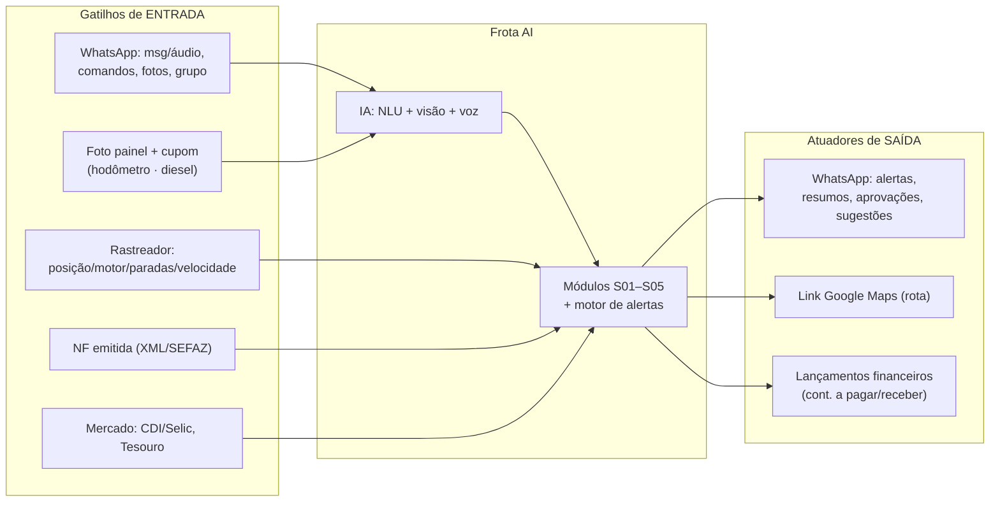

# Integrações — Frota AI · Transportes Molinett

> Documento 2 de 4 · cada integração que o projeto **realmente** usa, com autenticação, rotas na ordem do fluxo, exemplos de payload, webhooks e cuidados operacionais. Rotas e versões **verificadas em fontes oficiais (junho/2026)**; o que não foi confirmável está marcado **`[A VALIDAR]`**.
> Princípio: a Frota AI é **camada por cima** dos sistemas de origem — não os substitui. As **planilhas**, sim, são substituídas (ver [Doc 1](escopo-funcional-molinett.md)).

---

## 0. Visão geral — gatilhos de entrada × atuadores de saída



| Integração | Papel | Estado no MVP |
|---|---|---|
| **WhatsApp Business Cloud API** (Meta) | Canal proativo e conversacional (in/out) | ✅ Incluso — núcleo |
| **Rastreador** (Assemilsat→Log Soluções / SegMov) | Posição, motor, paradas, velocidade, hora-extra | ⚠️ Incluso (≥1) — **decisão bloqueante** |
| **IA multimodal** (Gemini recomendado) | OCR hodômetro/cupom, transcrição de voz PT-BR, NLU | ✅ Incluso — núcleo |
| **OCR fiscal de cupom / NFC-e** | QR Code → chave SEFAZ; fallback OCR de recibo | ✅ Incluso |
| **Cartão combustível** (Inter Empresas?) | Captura automática de abastecimento | 🟡 Opcional/complementar |
| **Dados de NF emitida** (SEFAZ) | Cruzar receita realizada × NF | ✅ Incluso (caminho a validar) |
| **Mercado financeiro** (BCB SGS, Tesouro) | Taxas reais p/ comparador de cenários | ✅ Incluso (MVP viável) |
| **Open Finance / bancos** (Inter, Sicoob, BB, Caixa) | Conciliação e ofertas de investimento | 🔵 Futura/bloqueante |
| **Multas (Adv. Tauã) · RH (Keily)** | Recursos de multa · disciplina | 🔵 Futura opcional |
| **Google Maps** | Deep link de rota na OS | ✅ Incluso (link, sem API paga) |

---

## 1. WhatsApp Business Cloud API (Meta)

Canal principal da plataforma (S02 e comandos de todos os módulos). **Usar a API oficial** — soluções não-oficiais (Z-API, Evolution, Baileys) violam os Termos da Meta e arriscam **banimento do número**; aceitáveis só para protótipo descartável.

- **Base URL:** `https://graph.facebook.com/v25.0/` (Graph API **v25.0**, atual em 02/2026).
- **Autenticação:** **System User access token** (permanente) com escopos `whatsapp_business_messaging` e `whatsapp_business_management`. IDs necessários: **Phone Number ID**, **WABA ID**, **App ID**, **App Secret**.
- **Docs:** [Cloud API — Get Started](https://developers.facebook.com/docs/whatsapp/cloud-api/get-started/) · [Tokens & System Users](https://developers.facebook.com/docs/whatsapp/cloud-api/get-started/access-tokens-and-system-users/)

### 1.1 Rotas na ordem do fluxo

| # | Método | Rota | Observação | Doc |
|---|---|---|---|---|
| 1 | POST | `/v25.0/{phone-number-id}/register` | Registrar nº (`{"messaging_product":"whatsapp","pin":"<6díg>"}`) | [Registration](https://developers.facebook.com/docs/whatsapp/cloud-api/reference/registration/) |
| 2 | — | Configurar **webhook** + assinar campo `messages` | Recebe mensagens e status | [Webhooks](https://developers.facebook.com/docs/whatsapp/cloud-api/guides/set-up-webhooks/) |
| 3 | POST | `/v25.0/{WABA_ID}/message_templates` | Criar templates (aprovação prévia) | [Templates](https://developers.facebook.com/documentation/business-messaging/whatsapp/templates/overview) |
| 4 | POST | `/v25.0/{phone-number-id}/messages` | Enviar texto / template / interativa / mídia | [Messages](https://developers.facebook.com/docs/whatsapp/cloud-api/reference/messages/) |
| 5 | POST | `/v25.0/{phone-number-id}/messages` | Marcar como lida (`status:"read"`) | [Mark as read](https://developers.facebook.com/docs/whatsapp/cloud-api/guides/mark-message-as-read/) |
| 6 | GET | `/v25.0/{media-id}` | Obter URL da mídia recebida (áudio); URL válida **5 min** | [Media](https://developers.facebook.com/docs/whatsapp/cloud-api/reference/media/) |
| 7 | GET | `{media-url}` | Baixar binário (header `Authorization: Bearer <token>`) | (idem Media) |

### 1.2 Exemplos

**Enviar template (fora da janela de 24h — ex.: alerta de vencimento):**
```http
POST /v25.0/{phone-number-id}/messages
Authorization: Bearer {SYSTEM_USER_TOKEN}
Content-Type: application/json

{ "messaging_product":"whatsapp", "to":"55XXXXXXXXXXX", "type":"template",
  "template":{ "name":"alerta_vencimento", "language":{"code":"pt_BR"},
    "components":[{"type":"body","parameters":[
      {"type":"text","text":"3 boletos amanhã, total R$ 4.300"},
      {"type":"text","text":"caixa projetado R$ 8.500 — suficiente"}]}]}}
```

**Texto livre (dentro da janela de 24h — ex.: resposta a comando):**
```json
{ "messaging_product":"whatsapp","to":"55XXXXXXXXXXX","type":"text",
  "text":{"body":"Saldo do mês: faltam R$ 38.250 para a meta. 12 OSs em aberto."} }
```

**Webhook recebido (áudio para transcrição):**
```json
{ "entry":[{"changes":[{"value":{
  "messages":[{"from":"55XXXXXXXXXXX","id":"wamid....","type":"audio",
    "audio":{"id":"<MEDIA_ID>","mime_type":"audio/ogg; codecs=opus","voice":true}}]
}}]}] }
```
→ `GET /v25.0/<MEDIA_ID>` → baixar `url` → transcrever (ver §3).

### 1.3 Webhook — handshake e assinatura
- **Verificação (GET):** a Meta envia `hub.mode=subscribe`, `hub.verify_token`, `hub.challenge`. O servidor valida o token e **responde o `hub.challenge` com HTTP 200**.
- **Assinatura (POST):** validar header **`X-Hub-Signature-256`** = `sha256=HMAC_SHA256(corpo, App Secret)`.
- **Eventos:** `messages` (recebidas: text/audio/image…) e `statuses` (sent/delivered/read/failed). Retentativa por até 7 dias se não retornar 200. Doc: [Webhooks getting started](https://developers.facebook.com/docs/graph-api/webhooks/getting-started/).

### 1.4 Templates e janela de 24h
- **Categorias:** `MARKETING`, `UTILITY`, `AUTHENTICATION` — aprovação obrigatória.
- **Janela de 24h:** dentro dela, qualquer mensagem livre; **fora dela, só template aprovado**. Resumos diários e alertas proativos serão majoritariamente **templates UTILITY**.

### 1.5 Áudio/voz
Áudio recebido: **máx 16 MB**; nota de voz (PTT) = **`.ogg`/OPUS** mono. Baixar via `GET /{media-id}` → transcrever. Doc: [Audio messages](https://developers.facebook.com/docs/whatsapp/cloud-api/messages/audio-messages/).

### 1.6 Preços e limites
- **Cobrança por template entregue desde 01/07/2025**; **mensagens de serviço (free-form) grátis**; **utility dentro da janela de 24h grátis**. Brasil fatura em **USD → BRL a partir de 01/07/2026** (valores exatos em rate cards logados — `[A VALIDAR]`). [Pricing](https://developers.facebook.com/docs/whatsapp/pricing/updates-to-pricing/).
- **Limites de mensagens:** 250 → 2.000 → 10.000 → 100.000 → ilimitado usuários únicos/24h; qualidade por número (GREEN/YELLOW/RED). [Messaging limits](https://developers.facebook.com/docs/whatsapp/messaging-limits).
- **Opt-in obrigatório** para proativas: declarar o nome da empresa e o aceite. [Opt-in](https://developers.facebook.com/docs/whatsapp/overview/getting-opt-in).

### 1.7 ⚠️ Ponto de arquitetura — captação de grupos e etiquetas
O Escopo v3 prevê **monitorar grupos** de WhatsApp (palavras-chave) e **ler etiquetas/orçamentos** (etiqueta da Karina). A **Cloud API oficial entrega apenas mensagens trocadas com o número de negócio** — **não espelha grupos arbitrários nem etiquetas** do app/WhatsApp Web. Abordagens possíveis (a decidir na descoberta):
1. **Número de captação dedicado** para o qual a equipe encaminha as notas/orçamentos (oficial, recomendado).
2. **Grupo cujo administrador é o número de negócio**, com a equipe usando-o como canal de solicitação `[A VALIDAR]` cobertura da API.
3. Encaminhamento manual da etiqueta para o número da plataforma.
> Não adotar biblioteca não-oficial em produção. **Decisão a registrar no G0.**

---

## 2. Rastreador veicular — ⚠️ DECISÃO TÉCNICA BLOQUEANTE

O escopo exige integração com **ao menos um** rastreador (Assemilsat **ou** SegMov) para posição, motor, paradas, velocidade e hora-extra. **KM não vem do rastreador** (vem do OCR — §3/Doc 1). A pesquisa confirmou que **nenhum dos dois publica API**:

### 2.1 Assemilsat
- **Site:** [assemilsat.com.br](https://www.assemilsat.com.br/) · área do cliente [novo.assemilsat.com.br](https://novo.assemilsat.com.br/entrar). CNPJ 07.984.633/0001-20 (Chapecó/SC).
- **API pública:** **não existe** documentação/portal de desenvolvedor.
- **Achado-chave:** o app Android é `br.com.logsolucoes.assemilsat` → a plataforma é **white-label da [Log Soluções](https://logsolucoes.com/)** (Chapecó/SC), que **declara possuir webservice**: *"Dispomos de webservices para comunicação com outros sistemas (ERP, TMS, etc) … informações de posicionamento e eventos do rastreador"*. Contato Log Soluções: `contato@logsolucoes.com`, (49) 3324-2735.
- **Caminho:** solicitar à Assemilsat **acesso ao webservice da Log Soluções** (contrato + credenciais). Formato (REST/SOAP) e campos **não são públicos** → confirmar.

### 2.2 SegMov
- Micro-operadora (Francisco Beltrão/PR; mesma titularidade de "MEGA SAT"). **Sem site, sem app, sem API** — contato só por WhatsApp (46) 98822-7579 ([Instagram](https://www.instagram.com/segmov.rastreamento/)). Backend não identificável publicamente.
- **Caminho:** perguntar diretamente "qual o app/plataforma que vocês fornecem?" para descobrir o backend white-label e então usar a API daquela plataforma; ou negociar feed direto.

### 2.3 Caminhos alternativos (padrão de mercado)
| Padrão | Como | Quando usar |
|---|---|---|
| **(b) API da plataforma** | Consumir webservice (Log Soluções / outro), REST/SOAP por contrato | **Preferido** se existir e houver credenciais |
| **(a) Stream do dispositivo → Traccar** | Reprovisionar o **APN/IP do rastreador** para um servidor próprio com **[Traccar](https://www.traccar.org/)** (open-source, 200+ protocolos: Suntech, GT06, Queclink, Teltonika; REST/JSON em `:8082`, WebSocket `/api/socket`) | Se a Molinett **controlar/puder reprovisionar** os aparelhos |
| **(c) Import de relatórios** | CSV/Excel agendado | Só conciliação/backfill — **sem tempo real** |

> **Recomendação:** adotar uma **camada de normalização** com esquema canônico único (`device_id, ts, lat, lon, speed, ignition, event_type`) e adaptadores finos por fonte. **Traccar** serve como normalizador para qualquer aparelho reprovisionável. Docs: [Traccar API](https://www.traccar.org/traccar-api/) · [Protocols](https://www.traccar.org/protocols/).

### 2.4 Perguntas comerciais a fazer (G0 — bloqueante)
1. Existe **webservice/API**? REST ou SOAP? Documentação?
2. **Credenciais** (usuário/token/certificado) e custo?
3. **Campos** disponíveis (posição, ignição, paradas, velocidade, hora-extra, horímetro)?
4. **Webhook** (push) ou só **polling**? Frequência/latência?
5. Há limite de chamadas? Histórico disponível?
6. (Assemilsat) Confirmar que é Log Soluções e solicitar contato técnico deles.

---

## 3. IA multimodal — OCR (hodômetro/cupom) + voz PT-BR + NLU

Recomendação: **padronizar na família Gemini** (um endpoint cobre visão, voz e NLU), com **adaptador de provedor** para permitir Claude/OpenAI sem reescrever o sistema. (Claude tem visão excelente para NLU/raciocínio, mas **não aceita áudio** — por isso a voz vai para Gemini/Whisper.)

### 3.1 Gemini (recomendado — visão + voz + NLU)
- **Base URL:** `https://generativelanguage.googleapis.com/v1beta/models/{model}:generateContent` (Google AI) ou via **Vertex AI**.
- **Auth:** API key (Google AI) ou Service Account/OAuth (Vertex).
- **Modelos (jun/2026):** `gemini-2.5-flash` (custo/benefício p/ hodômetro, voz e NLU); `gemini-2.5-pro`/`gemini-3.x` quando precisar de mais raciocínio `[A VALIDAR]` ID de preview vigente.
- **Doc:** [ai.google.dev/gemini-api/docs/models](https://ai.google.dev/gemini-api/docs/models) · [Vision](https://ai.google.dev/gemini-api/docs/vision) · [Audio](https://ai.google.dev/gemini-api/docs/audio).

**Hodômetro (foto do painel → JSON):**
```json
POST .../models/gemini-2.5-flash:generateContent
{ "contents":[{"parts":[
  {"inline_data":{"mime_type":"image/jpeg","data":"<base64>"}},
  {"text":"Leia SOMENTE o hodômetro (km) deste painel. Identifique o modelo do painel se possível. Responda JSON: {\"odometro_km\":int,\"confianca\":0-1,\"modelo_painel\":str}"}
]}], "generationConfig":{"response_mime_type":"application/json"} }
```

### 3.2 Transcrição de voz (alternativas)
| Opção | Endpoint | Auth | Preço (ordem) | Doc |
|---|---|---|---|---|
| **Gemini** (áudio direto) | `…:generateContent` | API key/SA | áudio in ~US$1,00/1M tok | ai.google.dev/gemini-api/docs/audio |
| OpenAI `whisper-1` / `gpt-4o-mini-transcribe` | `api.openai.com/v1/audio/transcriptions` | Bearer | US$0,006/min (whisper) | [platform.openai.com](https://platform.openai.com/docs/guides/speech-to-text) |
| Google Speech-to-Text v2 `chirp_3` | `speech.googleapis.com/v2/...:recognize` | SA/OAuth | ~US$0,016/min | [cloud.google.com/speech-to-text](https://cloud.google.com/speech-to-text/docs) |

### 3.3 NLU / orquestração
Mesmo modelo da §3.1 com **function calling / structured outputs** para interpretar "cotação de Chapecó a Xanxerê, Renault Master, particular" e rotear comandos. Alternativas: **Claude** `claude-opus-4-8`/`claude-sonnet-4-6` ([docs.anthropic.com](https://docs.anthropic.com/), `api.anthropic.com/v1/messages`, header `x-api-key`); **OpenAI** `gpt-5.4`/`gpt-5.5` (`/v1/responses`). `[A VALIDAR]` IDs/preços vigentes na contratação.

---

## 4. OCR fiscal de cupom de abastecimento (diesel)

**Caminho fiscalmente correto (primário) — evitar OCR:** o cupom de combustível é uma **NFC-e (modelo 65)**; o **DANFE traz um QR Code** que codifica a **URL do portal SEFAZ da UF** com a **chave de acesso de 44 dígitos** (`chNFe`). Lendo o QR Code obtém-se a chave e o dado oficial (CNPJ do posto, volume, valor, R$/L, data) **sem erro de OCR**.

- **Consulta é por estado** (não há API nacional aberta ao consumidor). Para SC, usar o portal NFC-e da SEFAZ/SC; recuperar o **XML completo** exige **certificado digital e-CNPJ**.
- **Doc:** [Manual de Padrões Técnicos do DANFE NFC-e / QR Code](https://www.nfe.fazenda.gov.br/portal/principal.aspx) · [Portal Nacional NF-e](https://www.nfe.fazenda.gov.br/) · ENCAT [nfce.encat.org].

**Fallback (cupom rasgado / recibo não-fiscal):**
| Serviço | Endpoint | Auth | Preço | Doc |
|---|---|---|---|---|
| AWS Textract `AnalyzeExpense` | `textract.{region}.amazonaws.com` (⚠️ **sem região São Paulo**) | IAM/SigV4 | ~US$10/1.000 pág. | [aws.amazon.com/textract](https://aws.amazon.com/textract/) |
| Azure Document Intelligence `prebuilt-receipt` v4.0 | `{rec}.cognitiveservices.azure.com/...` (roda em Brazil South) | API key/Entra | ~US$10/1.000 `[A VALIDAR]` | [learn.microsoft.com](https://learn.microsoft.com/azure/ai-services/document-intelligence/) |
| Gemini multimodal | §3.1 | API key/SA | baixo | ai.google.dev |

> **Fluxo recomendado:** ler QR Code localmente → chave → consulta SEFAZ; se ilegível, OCR de fallback; sempre **vincular motorista + placa** ao registro e gerar **pendência se faltar cupom**.

---

## 5. Cartão combustível (Inter Empresas) — opcional/complementar

Quando disponível, captura parte dos dados de abastecimento sem foto. O **Banco Inter** publica API PJ (Banking/Pix/Cobrança) em [developers.inter.co](https://developers.inter.co/) (auth por **client credentials + certificado mTLS** emitidos no Internet Banking). A existência de **API específica do cartão/extrato de combustível** precisa ser confirmada com o Inter — `[A VALIDAR]`. Sem API, o caminho permanece o **OCR de cupom** (§4).

---

## 6. Dados de NF emitida + mercado financeiro

### 6.1 Cruzar receita realizada × NF (S05)
Opções (definir na descoberta):
1. **`NFeDistribuicaoDFe`** (webservice SEFAZ): puxa DF-e por **NSU** (janela de 90 dias) — exige **certificado e-CNPJ ICP-Brasil**. Doc: [Portal NF-e](https://www.nfe.fazenda.gov.br/).
2. **Import periódico de XML** exportado pelo emissor/contabilidade.
3. **Conexão direta com o emissor de NF** (se houver API) `[A VALIDAR]`.
> ⚠️ Confirmar antes o **documento fiscal** do reboque: **CT-e (modelo 57)** se transporte de carga, ou **NFS-e** se serviço (ISS) — define o webservice e o layout (ver [Doc 1 §3.5](escopo-funcional-molinett.md)).

### 6.2 Taxas reais p/ comparador de cenários (MVP viável)
| Fonte | Endpoint | Auth | Uso | Doc |
|---|---|---|---|---|
| **BCB SGS** | `https://api.bcb.gov.br/dados/serie/bcdata.sgs.{cod}/dados?formato=json` | nenhuma | CDI=**12**, Selic over=**11**, Meta Selic=**432** | [dadosabertos.bcb.gov.br](https://dadosabertos.bcb.gov.br/) |
| **Tesouro Transparente** | CSV diário "Taxas dos Títulos Ofertados" | nenhuma | Preços/taxas do Tesouro Direto | [tesourotransparente.gov.br](https://www.tesourotransparente.gov.br/ckan/dataset/taxas-dos-titulos-ofertados-pelo-tesouro-direto) |

> Não há API JSON **oficial** de preços do Tesouro Direto — usar o **CSV** (o endpoint do site tesourodireto.com.br é interno/não documentado, evitar em produção).

---

## 7. Integrações futuras / bloqueantes (fora do MVP)

| Integração | Por que fica para depois | Caminho |
|---|---|---|
| **Open Finance Brasil** (conta/transações/Pix) | Acesso direto exige **instituição autorizada pelo BCB**; **ITP** = IP autorizada (Res. BCB 80/2021, capital R$1M, certificação FAPI/DCR) | Via **agregador** ([Pluggy](https://pluggy.ai/) / [Belvo](https://belvo.com/) — camada ITP regulada) no futuro; [Portal Open Finance](https://openfinancebrasil.org.br/) |
| **APIs bancárias PJ** (Inter, Sicoob, BB, Caixa) | Onboarding/credenciais por banco; Caixa sem autoatendimento | Inter mais simples ([developers.inter.co](https://developers.inter.co/)); Sicoob ([developers.sicoob.com.br](https://developers.sicoob.com.br/)); BB ([bb.com.br/developers](https://www.bb.com.br/site/developers/)) |
| **OFX** (conciliação) | — (viável já, baixo custo) | Parser de arquivo `.OFX` baixado do internet banking (carrega a conta de origem) |
| **Multas — Adv. Tauã** | Sistema de terceiro | Integração sob demanda (recursos, identificação de condutor) |
| **RH — Keily** | Sistema de terceiro | Integração sob demanda (advertências/disciplina) |
| **Emissão de NF Nacional** | Reforma — liberação por setor | Quando habilitado p/ transporte |

---

## 8. Resumo de credenciais por integração

| Integração | Credenciais necessárias | Quem fornece |
|---|---|---|
| WhatsApp Cloud API | System User Token, Phone Number ID, WABA ID, App ID, App Secret, Verify Token (webhook) | Conta Meta Business da Molinett (ou BSP) |
| Rastreador (Log Soluções/SegMov) | Endpoint, usuário/token (ou certificado); ou acesso p/ reprovisionar APN (Traccar) | Provedor + Molinett — **G0 bloqueante** |
| Gemini / IA | API key (Google AI) ou Service Account (Vertex) | Conta Google Cloud (criada no projeto) |
| OCR fallback (Textract/Azure) | IAM/Access Keys ou API key | Conta AWS/Azure (criada no projeto) |
| SEFAZ (NFeDistribuicaoDFe) | **Certificado digital e-CNPJ A1** ICP-Brasil | Molinett (contabilidade) |
| BCB SGS / Tesouro | nenhuma (dados abertos) | — |
| Cartão combustível (Inter) | client_id/secret + certificado mTLS | Molinett (Internet Banking Inter) |
| Google Maps (deep link) | nenhuma p/ link `https://www.google.com/maps/dir/...`; API key só se usar SDK | — |

> Detalhe operacional de cada credencial (o que o Claude Code **pede** vs **cria**) em [Doc 3 §Checklist](specs-tecnicas-molinett.md).

---

*Grupo Diga · Frota AI — Integrações · Transportes Molinett · v1.0 · 2026-06-15*
